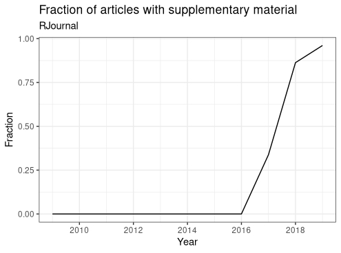

```{r, include = FALSE}
knitr::opts_chunk$set(
  collapse = TRUE,
  comment = "#>"
)
```

# Introduction

A number of articles written in PDF files contain code snippets. These are usually just a method to achieve results presented in the paper. However, a curious user might want to run these codes for himself - to replicate the results, experiment for themselves or for other reasons. Unfortunately, the process of extracting code manually might prove long, boring and prone to mistakes. Some articles are submitted with *supplementary material* with code files, although (in case of [RJournal](https://journal.r-project.org/)) it's just a recent development:



For articles published longer ago, the extraction of the code is left to the user.

# Package CodeExtractoR

With package `CodeExtracoR` the code may be extracted in a manner of seconds:

```{r setup, eval = FALSE}
library(CodeExtractoR)
my_url <- "https://journal.r-project.org/archive/2014/RJ-2014-011/RJ-2014-011.pdf"
api_key <- "my_api_key"
extract_code_from_pdf(my_url, output_file = "output.R", api_key = api_key)
```

It uses API to [cloudconvert](https://cloudconvert.com/pdf-to-html) to convert pdf to html file, and extracts code from html based on its unique font. Therefore, package will not work on files, where code font is non-standard. 

Obtaining your own API key to [cloudconvert](https://cloudconvert.com/pdf-to-html) (**version 1**) is suggested - registration is free and the API free plan should be more than sufficient. The user might also convert the pdf file manually and use it instead:

```{r, eval=FALSE}
extract_code_from_html('input.html', 'output.R')
```

Package will work only on HTML files created with [cloudconvert](https://cloudconvert.com/pdf-to-html) or any other converter using [pdf2htmlex](https://github.com/coolwanglu/pdf2htmlEX). 

# Customization

